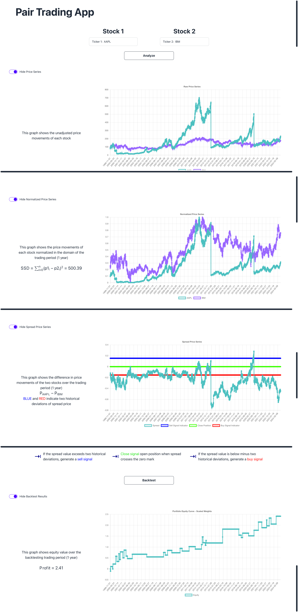

# Pair Trading App

## Overview

The Pair Trading App is a tool designed for financial analysis and backtesting of pair trading strategies. This
application allows users to compare stock data, analyze price series, and simulate a pair trading strategy to evaluate
its profitability on any given pair of stocks. The app utilizes data from the Alhpa Vantage API to provide detailed and
accurate financial data. 

## Features 

- **Stock Data Comparison**: Compare two stocks by analyzing their raw, normalized, and spread price series.
- **Trading Strategy Simulation**: Perform backtesting on pair ttrading strategy to assess historical performace.
- **Interactive Charts**: Visualize stock data and trading signals through interactive charts.

## Components

### Backend

- **server.js**: Starts the Express server and listens on a specified port.
- **stockController.js**: Fetches stock data from the Alpha Vantage API.
- **stockRoutes.js**: Defines routes for fetching stock data.

### Frontend

- **StockComparison.js**: Main component for fetching and comparing stock data.
- **GraphDescription.js**: Renders different types of stock charts with descriptions.
- **StockChart.js**: Displays various stock charts based on the provided data.

### Utility

- **Calculations.js**: Contains various functions for data transformation, normalization, statistical calculations, and backtesting.

## Installation

1. **Clone the repository**:
   ```sh
   git clone https://github.com/yourusername/pair-trading-app.git
   cd pair-trading-app

2. **Install dependencies**:
   ```sh
   npm install

3. **Set up environment variables**:  
    Create a `.env` file in the `backend` directory with the following content:
   ```sh
   ALPHA_VANTAGE_API_KEY=your_api_key_here
   
## Running the Application

1. **Start the frontend server**:
   ```sh
   cd pair-trading-app
   npm start

2. **Start the backend server**:
   ```sh
   cd pair-trading-app
   cd backend
   node server.js
   
## Usage

* **Open the application**: Navigate to http://localhost:3000 in your web browser.
* **Enter Stock Symbols**: Input the stock symbols you wish to compare (e.g., AAPL, MSFT).
* **Analyze Data**: Click the "Analyze" button to fetch and visualize the stock data.
* **Backtest Strategy**: Click the "Backtest" button to perform a backtest on the pair trading strategy.

## File Structure

```plaintext
pair-trading-app/
├── backend/
│   ├── controllers/
│   │   └── stockController.js
│   ├── routes/
│   │   └── stockRoutes.js
│   ├── server.js
│   └── .env
├── frontend/
│   ├── src/
│   │   ├── components/
│   │   │   ├── AnimatedBullets.js
│   │   │   ├── GraphDescription.js
│   │   │   ├── MenuBar.js
│   │   │   ├── StockChart.js
│   │   │   └── StockComparison.js
│   │   ├── App.css
│   │   ├── App.js
│   │   └── index.js
│   ├── public/
│   │   └── index.html
│   └── package.json
├── README.md
└── .gitignore
```

## License 

This project is licensed under the MIT License - see the LICENSE file for details

## Contact

- Email: [bb623@cornell.edu](mailto:bb623@cornell.edu)
- Website: [bhuwanbhattarai.com](https://bhuwanbhattarai.com/)
- LinkedIn: [linkedin.com/in/bhuwan-bhattarai](https://www.linkedin.com/in/bhuwan-bhattarai/)

## Demo

(Ignore black bars)


